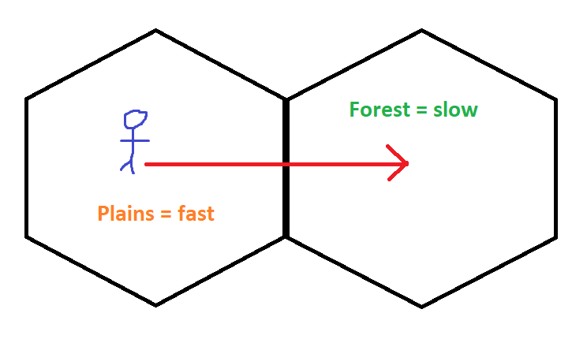

# hexagonal_pathfinding_astar

This library is an implementation of the A-Star pathfinding algorithm tailored for traversing a bespoke collection of weighted hexagons. It's intended to calculate the most optimal path to a target hexagon where you are traversing from the centre of one hexagon to the next along a line orthogonal to a hexagon edge.

It's rather different in that it follows a convention whereby a hexagon has a measurement which reflects the difficulty of traversing a distance over time called complexity (don't ask why I didn't name it velocity).

E.g

```txt
    ___________
   /     ^     \
  /      |      \
 /    c  |       \
 \       |       /
  \      ▼      /
   \___________/
```

For a grid of perfectly flush hexagons the distance from the centre to the midpoint of an edge is the same in all directions. This library is akin to idea that you wake up in a 'hexagon world' and you can only move from the centre of one hexagon to another in a straight line, but while distance is static you'll find that as you cross the boundary of one hexagon into another you'll suddenly be sprinting instead of slow-motion walking.

Generic example: Imagine leaving your house and standing by the side of a road. You want to go to a shop and there's two to choose from, one to the left and one to the right. They are both 100 meters away from you however if you go left you'll have to walk through a busy high street whereas going right leads to a much quieter area of town where you can ride a bicycle. To complete your shopping as quickly as possible you'll want to go right. This is what I mean by complexity, it isn't a measure of a hexagons width, all distances are the same, rather it is a measure of how quickly you can traverse it.

Another example, say you're a character in an RPG standing on a hexagon which denotes an open space. If you move East to the next hexagon you'll be standing in a forest. For a period of time in your starting hexagon you'll be moving at a good pace, once you cross the hexagon boundary into the forest you'll be moving more slowly towards the centre of that hexagon.



This library is all about calculating movement as if you're in some bizarre hexagon world moving along strict paths.

I've created it as I'm currently building a game using the [Bevy](https://github.com/bevyengine/bevy) engine. It's a procedural hexagonal world where each hexagon can be a different biome, such as mountains, plains, desert. The biome impacts the speed which you can cross the hexagon and is played in realtime so you not only feel crossing the width of space denoted by a hexagon but also you feel the impact of the underlying terrain.

Limitations:

* Your hexagon grid can have no more than `usize::MAX -1` columns, otherwise it'll panic on overflow
* Your hexagon grid can have no more than `usize::MAX -1` rows, otherwise it'll panic on overflow

Table of contents

1. [A-Star Super Simple in Brief](#simpleExplanation)
2. [Difference between normal A-Star and this Hexagon-world Weirdness](#diff)
3. [Hexagon Layout/Orientation](#orientation)
    1. [Flat Topped - odd columns shifted up](#ftou)
    1. [Flat Topped - odd columns shifted down](#ftod)
4. [How to use](#howto)
5. [Example - Simple Complexities: A-Star for Flat Topped Odd Column Shifted Up Grid](#example1)
6. [Example - Varying Complexity: A-Star for Flat Topped Odd Column Shifted Up](#example2)

## A-Star Super Simple in Brief <a name="simpleExplanation"></a>

This is my super basic breakdown of A-Star which uses the traditional distance instead of my custom complexity (ou could use it to work out which roads to drive down in the countryside to reach some destination).

If we take a starting point `S` and wish to move to end point `E` we have two paths we could choose to traverse, to `O1` or to `O2`.

```txt
                        Length:22             W:4
                 S ----------------------> O1
                 |                         |
                 |                         |
        Length:5 |                         | Length:4
                 |                         |
                 ▼                         ▼
                 O2 ---------------------> E
            W:1          Length:20            W:2
```

Each point has an associated weight `W` which is a general measure designed to guide the algorithm.

To find the opitmal path we discover the available routes from our starting point `S`, the distance from `S` to a given point and create an A-Star score for moving along a path. For instance:

* The distance between `S` and `O1` is `22`
* The A-Star score of moving from `S` to `O1` is the sum of the distance moved with the weight of the point, i.e `22 + 4 = 26`

We then consider the alternate route of moving from `S` to `O2`:

* The distance between `S` and `O2` is `5`
* The A-Star score is therefore `5 + 1 = 6`

We can see that currently the most optimal route is to move from `S` to `O2`, as moving to `O2` has a better A-Star score we interrogate this point first.

From `O2` we discover that we can traverse to `E`:

* The overall disatnce covered is now `20 + 5 = 25`
* The A-Star score is the sum of the overall distance and the weight of `E`, `25 + 2 = 27`

So far we have explored:

* `S` to `O1` with an A-Star score of `26`
* `S` to `O2` to `E` with an A-Star score of `27`

As we still have a route avaiable with a better A-Star score we expand it, `O1` to `E`:

* Overall distance `22 + 4 = 26`
* The A-Star score is `26 + 2 = 28`

Now we know which path is better, moving via `O2` has a better final A-Star score (it is smaller).

The idea is that for a large number of points and paths certain routes will not be explored as they'd have much higher A-Star scores, this cuts down on search time. At the bottom of this README is a full example using a hexagon grid with numerous points and paths to show this more clearly.

## Difference between normal A-Star and this Hexagon-world Weirdness <a name="diff"></a>

Traditional A-Star uses `distance` and `weight` (normally called a heuristic) to determine an optimal path, this encourages it to seek a path to a single end point as effciently as possbile. The weight being a measurement between a point and end goal. Distances can vary enourmously.

For this hexagonal arrangemnt each hexagon maintains a heuristic called weight which guides the algorithm but distance is static, each hexagon has the same width. Instead I've added two new heuristics, each based on half of the width of a hexagon. Whereby one half of a hexagon could have a very efficient heuristic and the other half poor. I denote the combination of these two heuristics 'complexity' where a high complexity indicates a bad path to follow and replaces distance in the A-Star calculation. Weight is a linear measure of how far away a hexagon is from the end point/hexagon and is calculated within the library rather than being supplied.

In a way 'complexity' is a generalisation of unit distance... hmmm, need to think on it.

## Hexagon Layout/Orientation <a name="orientation"></a>

There are different ways in which a hexagon grid can be portrayed which in turn affects the discoverable neighbouring hexagons for path traversal. This library assumes that all hexagons have been plotted across a plane where the origin points sits at the bottom left - a deviation from this and the calcualtion simply won't work. Additionally a hexagon is herbey referred to as a 'node'.

Each node has a label defining its position, known as `(column, row)`. NB: the `column` and `row` values can never be negative.

### Flat Topped - odd columns shifted up <a name="ftou"></a>

```txt
             _______
            /       \
    _______/  (1,1)  \_______
   /       \         /       \
  /  (0,1)  \_______/  (2,1)  \
  \         /       \         /
   \_______/  (1,0)  \_______/
   /       \         /       \
  /  (0,0)  \_______/  (2,0)  \
  \         /       \         /
   \_______/         \_______/
```

The column shift changes how we discover nearby nodes. For instance if we take the node at (0,0) and wish to discover the node to its North-East, (1,0), we can simply increment the `column` value by one.

However if we take the node (1,0) and wish to discover its North-East node at (2,1) we have to increment both the `column` value and the `row` value. I.e the calculation changes depending on whether the odd column has been shifted up or down.

In full for a node in an even column we can calculate a nodes neighbours thus:

```txt
north      = (column, row + 1)
north-east = (column + 1, row)
south-east = (column + 1, row - 1)
south      = (column, row -1)
south-west = (column - 1, row - 1)
north-west = (column - 1, row)
```

And for a node in an odd column the node neighbours can be found:

```txt
north      = (column, row + 1)
north-east = (column + 1, row + 1)
south-east = (column + 1, row)
south      = (column, row -1)
south-west = (column - 1, row)
north-west = (column - 1, row + 1)
```

### Flat Topped - odd columns shifted down <a name="ftod"></a>

```txt
    _______           _______
   /       \         /       \
  /  (0,1)  \_______/  (2,1)  \
  \         /       \         /
   \_______/  (1,1)  \_______/
   /       \         /       \
  /  (0,0)  \_______/  (2,0)  \
  \         /       \         /
   \_______/  (1,0)  \_______/
           \         /
            \_______/
```

The column shift changes how we discover nearby nodes. For instance if we take the node at (0,0) and wish to discover the node to its North-East, (1,1), we increment the `column` and `row` values by one.

However if we take the node (1,1) and wish to discover its North-East node at (2,1) we have to only increment the `column` value by one.

In full for a node in an even column we can calculate a nodes neighbours thus:

```txt
north      = (column, row + 1)
north-east = (column + 1, row + 1)
south-east = (column + 1, row)
south      = (column, row -1)
south-west = (column - 1, row)
north-west = (column - 1, row + 1)
```

And for a node in an odd column the node neighbours can be found:

```txt
north      = (column, row + 1)
north-east = (column + 1, row)
south-east = (column + 1, row - 1)
south      = (column, row -1)
south-west = (column - 1, row - 1)
north-west = (column - 1, row)
```

## How to use <a name="howto"></a>

Cargo.toml

```toml
[dependencies]
hexagonal_pathfinding_astar = { git = "https://github.com/BlondeBurrito/hexagonal_pathfinding_astar" version = "0.1.0" }
```

```rust
// you are here
let start_node: (usize, usize) = (0, 0);
// keys are nodes, values are your measure of 'complexity' to traverse it
let mut nodes: HashMap<(usize, usize), f32> = HashMap::new();
nodes.insert((0,0), 1.0);
nodes.insert((0,1), 1.0);
nodes.insert((0,2), 1.0);
nodes.insert((0,3), 3.0);
nodes.insert((1,0), 2.0);
nodes.insert((1,1), 9.0);
nodes.insert((1,2), 4.0);
nodes.insert((1,3), 2.0);
nodes.insert((2,0), 2.0);
nodes.insert((2,1), 6.0);
nodes.insert((2,2), 8.0);
nodes.insert((2,3), 9.0);
nodes.insert((3,0), 3.0);
nodes.insert((3,1), 4.0);
nodes.insert((3,2), 5.0);
nodes.insert((3,3), 2.0);
// you want to go here
let end_node: (usize, usize) = (3, 3);
// the 'exclusive' limit of grid size
let max_column = 4;
let max_row = 4;
// the hexagon arrangement you are using
let orientation = HexOrientation::FlatTopOddUp;
let best = astar_path(start_node, nodes, end_node, max_column, max_row, orientation);
// answer using above data = [(0,0), (0,1), (0,2), (1,2), (2,3), (3,3)]
// the manual calculation for this can be found in Example - Varying Complexity: A-Star for Flat Topped Odd Column Shifted Up
```

## Example - Simple Complexities: A-Star for Flat Topped Odd Column Shifted Up <a name="example1"></a>

We wish to move from node `S - (0,0)` to node `E - (4,3)`. Each node has a weight `W`. This is a very simple example as we shall treat the complexity between of node as the same: 2 units (this is effectively using the regular A-Star algorithm where the distance between each point is the same).

```txt
             _______           _______
            /       \         /       \
    _______/  (1,3)  \_______/  (3,3)  \_______
   /       \   W:3   /       \   W:3   /   E   \
  /  (0,3)  \_______/  (2,3)  \_______/  (4,3)  \
  \   W:5   /       \   W:3   /       \   W:3   /
   \_______/  (1,2)  \_______/  (3,2)  \_______/
   /       \   W:3   /       \   W:1   /       \
  /  (0,2)  \_______/  (2,2)  \_______/  (4,2)  \
  \   W:3   /       \   W:3   /       \   W:2   /
   \_______/  (1,1)  \_______/  (3,1)  \_______/
   /       \   W:4   /       \   W:7   /       \
  /  (0,1)  \_______/  (2,1)  \_______/  (4,1)  \
  \   W:7   /       \   W:3   /       \   W:3   /
   \_______/  (1,0)  \_______/  (3,0)  \_______/
   /   S   \   W:4   /       \   W:3   /       \
  /  (0,0)  \_______/  (2,0)  \_______/  (4,0)  \
  \   W:6   /       \   W:5   /       \   W:3   /
   \_______/         \_______/         \_______/
```

Calculation form:

* A-Star =  `(0.5 * current_node_complexity) + (0.5 * neighbour_node_complexity) + previous_node_complexities + weight`
* As we're assuming uniform complexity of 2: A-Star = `2 + previous_node_complexities + weight`

However for the first node we are not traversing any complexity so its score is simply its weight.

To begin we establish a data set which will contain the A-Star score of every node we process, we begin by adding the starting nodes A-Star score:

| A-Star | Node |
| ------ | ---- |
| 6 | (0,0) |

Next we expand our starting node (starting North moving clock-wise) and place the discovered nodes (moveable paths) into a queue and calculate thier scores, we sort the queue in A-Star descending order:

* For node `(0,1)`, A-Star: `2 + 7 = 9`
* For node `(1,0)`, A-Star `2 + 4 = 6`

| A-Star score | Current node | Previous nodes traversed | Total Complexity |
| ------------ | ------------ | ------------------------ | -------------- |
| 6 | (1,0) | (0,0) | 2 |
| 9 | (0,1) | (0,0) | 2 |

And record each unique node in the data set:

| A-Star | Node |
| ------ | ---- |
| 6 | (0,0) |
| 6 | (1,0) |
| 9 | (0,1) |

We then expand from our queue, first for (1,0), we call this QUEUE-A for illustrative purposes:

| A-Star score | Current node | Previous nodes traversed | Total Complexity |
| ------------ | ------------ | ------------------------ | -------------- |
| 7 | (2,1) | (1,0),(0,0) | 4 |
| 8 | (1,1) | (1,0),(0,0) | 4 |
| 9 | (2,0) | (1,0),(0,0) | 4 |
| 11 | (0,1) | (1,0),(0,0) | 4 |

Then for (0,1), we call this QUEUE-B:

| A-Star score | Current node | Previous nodes traversed | Total Complexity |
| ------------ | ------------ | ------------------------ | -------------- |
| 7 | (0,2) | (0,1),(0,0) | 4 |
| 8 | (1,1) | (0,1),(0,0) | 4 |
| 8 | (1,0) | (0,1),(0,0) | 4 |

By comparing QUEUE-A and QUEUE-B you'll notice a duplicate `Current node` of `(1,1)`, we actually expand nodes into a single queue one at a time but these temporary queues can illustarte how duplcaites are handled and this is why we maintain a data set of each node score.

A duplicate indictaes we have discovered two paths that lead to the same point. This means we can get rid of the least efficient one, or in this case if they are the same we'll just remove the last one. We do this by comparing the duplicates score to the data set, if the current node being processed has a better A-Star score we overwrite the record in the data set and remove the older inefficient path from the queue. Conversely if the node we've just processed is worse we just remove the worse path from the queue and leave the data set as is.

Our data set is now:

| A-Star | Node |
| ------ | ---- |
| 6 | (0,0) |
| 6 | (1,0) |
| 7 | (2,1) |
| 7 | (0,2) |
| 8 | (1,1) |
| 8 | (1,0) |
| 9 | (0,1) |
| 11 | (0,1) |

And the actual queue with the duplciate route removed (note we removed old processed paths from the queue otherwise their A-Star scores would cause it to infinitely process the starting nodes):

| A-Star score | Current node | Previous nodes traversed | Total Complexity |
| ------------ | ------------ | ------------------------ | -------------- |
| 7 | (2,1) | (1,0), (0,0) | 4 |
| 7 | (0,2) | (0,1), (0,0) | 4 |
| 8 | (1,1) | (1,0), (0,0) | 4 |
| 8 | (1,0) | (0,1), (0,0) | 4 |
| 9 | (2,0) | (1,0), (0,0) | 4 |
| 11 | (0,1) | (1,0), (0,0) | 4 |

And once again we'll expand the node with the best A-Star score and add them into the queue, removing that processed path and sort it:

| A-Star score | Current node | Previous nodes traversed | Total Complexity |
| ------------ | ------------ | ------------------------ | -------------- |
| 6 | (2,2) | (2,1), (1,0), (0,0) | 6 |
| 7 | (0,2) | (0,1), (0,0) | 4 |
| 8 | (1,1) | (1,0), (0,0) | 4 |
| 8 | (1,0) | (0,1), (0,0) | 4 |
| 9 | (3,0) | (2,1), (1,0), (0,0) | 6 |
| 9 | (2,0) | (1,0), (0,0) | 4 |
| 11 | (0,1) | (1,0), (0,0) | 4 |
| 13 | (3,2) | (2,1), (1,0),(0,0) | 6 |

| A-Star | Node |
| ------ | ---- |
| 6 | (0,0) |
| 6 | (1,0) |
| 6 | (2,2) |
| 7 | (2,1) |
| 7 | (0,2) |
| 8 | (1,1) |
| 8 | (1,0) |
| 9 | (2,2) |
| 9 | (0,1) |
| 9 | (3,0) |
| 11 | (0,1) |
| 13 | (3,2) |

You may of noticed that by processing `(2,1)` we discovered 6 possible directions for movement, once again this is where the data set comes in. Three of those paths were heading 'backwards' away from the end point meaning they had higher A-Star scores. Comparing those 'backwards' scores to the data set means we simply discard them as more efficient paths have already been discovered.

Processing the best path in the queue again:

| A-Star score | Current node | Previous nodes traversed | Total Complexity |
| ------------ | ------------ | ------------------------ | -------------- |
| 7 | (0,2) | (0,1), (0,0) | 4 |
| 8 | (1,1) | (1,0), (0,0) | 4 |
| 8 | (1,0) | (0,1), (0,0) | 4 |
| 9 | (3,0) | (2,1), (1,0), (0,0) | 6 |
| 9 | (2,0) | (1,0), (0,0) | 4 |
| 9 | (3,2) | (2,2), (2,1), (1,0), (0,0) | 8 |
| 11 | (0,1) | (1,0), (0,0) | 4 |
| 11 | (1,2) | (2,2), (2,1), (1,0), (0,0) | 8 |
| 11 | (2,3) | (2,2), (2,1), (1,0), (0,0) | 8 |
| 15 | (3,1) | (2,2), (2,1), (1,0), (0,0) | 8 |

| A-Star | Node |
| ------ | ---- |
| 6 | (0,0) |
| 6 | (1,0) |
| 6 | (2,2) |
| 7 | (2,1) |
| 7 | (0,2) |
| 8 | (1,1) |
| 8 | (1,0) |
| 9 | (2,0) |
| 9 | (3,2) |
| 9 | (0,1) |
| 9 | (3,0) |
| 11 | (0,1) |
| 11 | (1,2) |
| 11 | (2,3) |
| 15 | (3,1) |

And again:

| A-Star score | Current node | Previous nodes traversed | Total Complexity |
| ------------ | ------------ | ------------------------ | -------------- |
| 8 | (1,1) | (1,0), (0,0) | 4 |
| 8 | (1,0) | (0,1), (0,0) | 4 |
| 9 | (3,0) | (2,1), (1,0),(0,0) | 6 |
| 9 | (2,0) | (1,0), (0,0) | 4 |
| 9 | (3,2) | (2,2), (2,1), (1,0), (0,0) | 8 |
| 9 | (1,2) | (0,2), (0,1), (0,0) | 6 |
| 11 | (0,3) | (0,2), (0,1), (0,0) | 6 |
| 11 | (0,1) | (1,0), (0,0) | 4 |
| 11 | (2,3) | (2,2), (2,1), (1,0), (0,0) | 8 |
| 15 | (3,1) | (2,2), (2,1), (1,0), (0,0) | 8 |

| A-Star | Node |
| ------ | ---- |
| 6 | (0,0) |
| 6 | (1,0) |
| 6 | (2,2) |
| 7 | (2,1) |
| 7 | (0,2) |
| 8 | (1,1) |
| 8 | (1,0) |
| 9 | (2,0) |
| 9 | (3,2) |
| 9 | (0,1) |
| 9 | (3,0) |
| 9 | (1,2) |
| 11 | (0,1) |
| 11 | (2,3) |
| 15 | (3,1) |

And again (in fact the top two scores don't determine any new routes more efficient than ones already discoverd so we'll remove them and process the third instead):

| A-Star score | Current node | Previous nodes traversed | Total Complexity |
| ------------ | ------------ | ------------------------ | -------------- |
| 9 | (2,0) | (1,0), (0,0) | 4 |
| 9 | (3,2) | (2,2), (2,1), (1,0), (0,0) | 8 |
| 9 | (1,2) | (0,2), (0,1), (0,0) | 6 |
| 11 | (4,0) | (3,0), (2,1), (1,0), (0,0) | 8 |
| 11 | (4,1) | (3,0), (2,1), (1,0), (0,0) | 8 |
| 11 | (0,3) | (0,2), (0,1), (0,0) | 6 |
| 11 | (0,1) | (1,0), (0,0) | 4 |
| 11 | (2,3) | (2,2), (2,1), (1,0), (0,0) | 8 |
| 15 | (3,1) | (2,2), (2,1), (1,0), (0,0) | 8 |

| A-Star | Node |
| ------ | ---- |
| 6 | (0,0) |
| 6 | (1,0) |
| 6 | (2,2) |
| 7 | (2,1) |
| 7 | (0,2) |
| 8 | (1,1) |
| 8 | (1,0) |
| 9 | (2,0) |
| 9 | (3,2) |
| 9 | (0,1) |
| 9 | (3,0) |
| 9 | (1,2) |
| 11 | (0,1) |
| 11 | (2,3) |
| 11 | (4,0) |
| 11 | (4,1) |
| 15 | (3,1) |

And again:

| A-Star score | Current node | Previous nodes traversed | Total Complexity |
| ------------ | ------------ | ------------------------ | -------------- |
| 9 | (1,2) | (0,2), (0,1), (0,0) | 6 |
| 11 | (4,0) | (3,0), (2,1), (1,0), (0,0) | 8 |
| 11 | (4,1) | (3,0), (2,1), (1,0), (0,0) | 8 |
| 11 | (0,3) | (0,2), (0,1), (0,0) | 6 |
| 11 | (0,1) | (1,0), (0,0) | 4 |
| 11 | (2,3) | (2,2), (2,1), (1,0), (0,0) | 8 |
| 12 | (4,2) | (3,2), (2,2), (2,1), (1,0), (0,0) | 10 |
| 13 | (3,3) | (3,2), (2,2), (2,1), (1,0), (0,0) | 10 |
| 13 | (4,3) | (3,2), (2,2), (2,1), (1,0), (0,0) | 10 |
| 15 | (3,1) | (2,2), (2,1), (1,0), (0,0) | 8 |

| A-Star | Node |
| ------ | ---- |
| 6 | (0,0) |
| 6 | (1,0) |
| 6 | (2,2) |
| 7 | (2,1) |
| 7 | (0,2) |
| 8 | (1,1) |
| 8 | (1,0) |
| 9 | (2,0) |
| 9 | (3,2) |
| 9 | (0,1) |
| 9 | (3,0) |
| 9 | (1,2) |
| 11 | (0,1) |
| 11 | (2,3) |
| 11 | (4,0) |
| 11 | (4,1) |
| 12 | (4,2) |
| 13 | (4,3) |
| 13 | (3,3) |
| 15 | (3,1) |

The 9th row in our queue now is actually the endpoint `(4,3)` but as there are still unexplored routes with better efficiency (A-Star) we must carry on discovering nodes to see if there's still a better path:

| A-Star score | Current node | Previous nodes traversed | Total Complexity |
| ------------ | ------------ | ------------------------ | -------------- |
| 11 | (1,3) | (1,2), (0,2), (0,1), (0,0) | 8 |
| 11 | (4,0) | (3,0), (2,1), (1,0), (0,0) | 8 |
| 11 | (4,1) | (3,0), (2,1), (1,0), (0,0) | 8 |
| 11 | (0,3) | (0,2), (0,1), (0,0) | 6 |
| 11 | (0,1) | (1,0), (0,0) | 4 |
| 11 | (2,3) | (2,2), (2,1), (1,0), (0,0) | 8 |
| 12 | (4,2) | (3,2), (2,2), (2,1), (1,0), (0,0) | 10 |
| 13 | (3,3) | (3,2), (2,2), (2,1), (1,0), (0,0) | 10 |
| 13 | (4,3) | (3,2), (2,2), (2,1), (1,0), (0,0) | 10 |
| 15 | (3,1) | (2,2), (2,1), (1,0), (0,0) | 8 |

| A-Star | Node |
| ------ | ---- |
| 6 | (0,0) |
| 6 | (1,0) |
| 6 | (2,2) |
| 7 | (2,1) |
| 7 | (0,2) |
| 8 | (1,1) |
| 8 | (1,0) |
| 9 | (2,0) |
| 9 | (3,2) |
| 9 | (0,1) |
| 9 | (3,0) |
| 9 | (1,2) |
| 11 | (1,3) |
| 11 | (0,1) |
| 11 | (2,3) |
| 11 | (4,0) |
| 11 | (4,1) |
| 12 | (4,2) |
| 13 | (4,3) |
| 13 | (3,3) |
| 15 | (3,1) |

Again (this wipes out loads of inefficient paths):

| A-Star score | Current node | Previous nodes traversed | Total Complexity |
| ------------ | ------------ | ------------------------ | -------------- |
| 13 | (4,3) | (3,2), (2,2), (2,1), (1,0), (0,0) | 10 |
| 15 | (3,1) | (2,2), (2,1), (1,0), (0,0) | 8 |

| A-Star | Node |
| ------ | ---- |
| 6 | (0,0) |
| 6 | (1,0) |
| 6 | (2,2) |
| 7 | (2,1) |
| 7 | (0,2) |
| 8 | (1,1) |
| 8 | (1,0) |
| 9 | (2,0) |
| 9 | (3,2) |
| 9 | (0,1) |
| 9 | (3,0) |
| 9 | (1,2) |
| 11 | (1,3) |
| 11 | (0,1) |
| 11 | (2,3) |
| 11 | (4,0) |
| 11 | (4,1) |
| 12 | (4,2) |
| 13 | (4,3) |
| 13 | (3,3) |
| 15 | (3,1) |

And finally we have arrived at the most optimal route from `S` to `E` as the end node has risne to the top of the queue, the path to follow is:

* (0,0) -> (1,0) -> (2,1) -> (2,2) -> (3,2) -> (4,3)

Which looks like:

```txt
                                        _______
                                       /   E   \
                               _______/  (4,3)  \
                              /       \   W:3   /
                      _______/  (3,2)  \_______/
                     /       \   W:1   /
                    /  (2,2)  \_______/
                    \   W:3   /
                     \_______/
                     /       \
             _______/  (2,1)  \
            /       \   W:3   /
    _______/  (1,0)  \_______/
   /   S   \   W:4   /
  /  (0,0)  \_______/
  \   W:6   /
   \_______/
```

## Example - Varying Complexity: A-Star for Flat Topped Odd Column Shifted Up <a name="example2"></a>

We wish to move from node `S - (0,0)` to node `E - (3,3)`. Each node has a weight `W` which is a linear representation of distance from the end point. Each hexagon contains a complexity value `C`.

```txt
                   _________               _________
                  /         \             /         \
                 /           \           /     E     \
       _________/    (1,3)    \_________/    (3,3)    \
      /         \     W:1     /         \     W:0     /
     /           \    C:2    /           \    C:2    /
    /    (0,3)    \_________/    (2,3)    \_________/
    \     W:3     /         \     W:1     /         \
     \    C:3    /           \    C:9    /           \
      \_________/    (1,2)    \_________/    (3,2)    \
      /         \     W:2     /         \     W:1     /
     /           \    C:4    /           \    C:5    /
    /    (0,2)    \_________/    (2,2)    \_________/
    \     W:3     /         \     W:2     /         \
     \    C:1    /           \    C:8    /           \
      \_________/    (1,1)    \_________/    (3,1)    \
      /         \     W:3     /         \     W:2     /
     /           \    C:9    /           \    C:4    /
    /    (0,1)    \_________/    (2,1)    \_________/
    \     W:4     /         \     W:3     /         \
     \    C:1    /           \    C:6    /           \
      \_________/    (1,0)    \_________/    (3,0)    \
      /         \     W:4     /         \     W:3     /
     /     S     \    C:2    /           \    C:3    /
    /    (0,0)    \_________/    (2,0)    \_________/
    \     W:5     /         \     W:4     /
     \    C:1    /           \    C:2    /
      \_________/             \_________/
```

In this scenarios we calculate A-Star by taking:

* `(0.5 * current_node_complexity) + (0.5 * target_node_complexity) + previous_complexities + weight`

Where `previous_complexities` is simply the previous `(0.5 * current_node_complexity) + (0.5 * target_node_complexity)`.

Our initial data set of A-Star scores:

| A-Star | Node |
| ------ | ---- |
| 5.0 | (0,0) |

Expanding from the starting node:

| A-Star score | Current node | Previous nodes traversed | Total Complexities |
| ------------ | ------------ | ------------------------ | -------------- |
| 5.0 | (0,1) | (0,0) | 1.0 |
| 5.5 | (1,0) | (0,0) | 1.5 |

| A-Star | Node |
| ------ | ---- |
| 5.0 | (0,0) |
| 5.0 | (0,1) |
| 5.5 | (1,0) |

Second expansion:

| A-Star score | Current node | Previous nodes traversed | Total Complexities |
| ------------ | ------------ | ------------------------ | -------------- |
| 5.0 | (0,2) | (0,1), (0,0) | 2.0 |
| 5.5 | (1,0) | (0,0) | 1.5 |
| 9.0 | (1,1) | (0,1), (0,0) | 6.0 |

| A-Star | Node |
| ------ | ---- |
| 5.0 | (0,1) |
| 5.0 | (0,2) |
| 5.5 | (0,0) |
| 5.5 | (1,0) |
| 9.0 | (1,1) |

Third expansion:

| A-Star score | Current node | Previous nodes traversed | Total Complexities |
| ------------ | ------------ | ------------------------ | -------------- |
| 5.5 | (1,0) | (0,0) | 1.5 |
| 6.5 | (1,2) | (0,2), (0,1), (0,0) | 4.5 |
| 7.0 | (0,3) | (0,2), (0,1), (0,0) | 4.0 |
| 9.0 | (1,1) | (0,1), (0,0) | 6.0 |

| A-Star | Node |
| ------ | ---- |
| 5.0 | (0,1) |
| 5.0 | (0,2) |
| 5.5 | (0,0) |
| 5.5 | (1,0) |
| 6.5 | (1,2) |
| 7.0 | (0,3) |
| 9.0 | (1,1) |

Forth expansion:

| A-Star score | Current node | Previous nodes traversed | Total Complexities |
| ------------ | ------------ | ------------------------ | -------------- |
| 6.5 | (1,2) | (0,2), (0,1), (0,0) | 4.5 |
| 7.0 | (0,3) | (0,2), (0,1), (0,0) | 4.0 |
| 7.5 | (2,0) | (1,0), (0,0) | 3.5 |
| 8.5 | (2,1) | (1,0), (0,0) | 5.5 |
| 9.0 | (1,1) | (0,1), (0,0) | 6.0 |

| A-Star | Node |
| ------ | ---- |
| 5.0 | (0,1) |
| 5.0 | (0,2) |
| 5.5 | (0,0) |
| 5.5 | (1,0) |
| 6.5 | (1,2) |
| 7.0 | (0,3) |
| 7.5 | (2,0) |
| 8.5 | (2,1) |
| 9.0 | (1,1) |

Fifth expansion:

| A-Star score | Current node | Previous nodes traversed | Total Complexities |
| ------------ | ------------ | ------------------------ | -------------- |
| 7.0 | (0,3) | (0,2), (0,1), (0,0) | 4.0 |
| 7.5 | (2,0) | (1,0), (0,0) | 3.5 |
| 8.5 | (2,1) | (1,0), (0,0) | 5.5 |
| 9.0 | (1,1) | (0,1), (0,0) | 6.0 |
| 9.5 | (1,3) | (1,2), (0,2), (0,1), (0,0) | 8.5 |
| 12.0 | (2,3) | (1,2), (0,2), (0,1), (0,0) | 11.0 |
| 12.5 | (2,2) | (1,2), (0,2), (0,1), (0,0) | 10.5 |

| A-Star | Node |
| ------ | ---- |
| 5.0 | (0,1) |
| 5.0 | (0,2) |
| 5.5 | (0,0) |
| 5.5 | (1,0) |
| 6.5 | (1,2) |
| 7.0 | (0,3) |
| 7.5 | (2,0) |
| 8.5 | (2,1) |
| 9.0 | (1,1) |
| 9.5 | (1,3) |
| 12.0 | (2,3) |
| 12.5 | (2,2) |

Sixth expansion:

| A-Star score | Current node | Previous nodes traversed | Total Complexities |
| ------------ | ------------ | ------------------------ | -------------- |
| 7.5 | (1,3) | (0,3), (0,2), (0,1), (0,0) | 6.5 |
| 7.5 | (2,0) | (1,0), (0,0) | 3.5 |
| 8.5 | (2,1) | (1,0), (0,0) | 5.5 |
| 9.0 | (1,1) | (0,1), (0,0) | 6.0 |
| 9.5 | (1,3) | (1,2), (0,2), (0,1), (0,0) | 8.5 |
| 12.0 | (2,3) | (1,2), (0,2), (0,1), (0,0) | 11.0 |
| 12.5 | (2,2) | (1,2), (0,2), (0,1), (0,0) | 10.5 |

| A-Star | Node |
| ------ | ---- |
| 5.0 | (0,1) |
| 5.0 | (0,2) |
| 5.5 | (0,0) |
| 5.5 | (1,0) |
| 6.5 | (1,2) |
| 7.0 | (0,3) |
| 7.5 | (2,0) |
| 7.5 | (1,3) |
| 8.5 | (2,1) |
| 9.0 | (1,1) |
| 12.0 | (2,3) |
| 12.5 | (2,2) |

Seventh expansion:

| A-Star score | Current node | Previous nodes traversed | Total Complexities |
| ------------ | ------------ | ------------------------ | -------------- |
| 7.5 | (2,0) | (1,0), (0,0) | 3.5 |
| 8.5 | (2,1) | (1,0), (0,0) | 5.5 |
| 9.0 | (1,1) | (0,1), (0,0) | 6.0 |
| 9.5 | (1,3) | (1,2), (0,2), (0,1), (0,0) | 8.5 |
| 12.0 | (2,3) | (1,2), (0,2), (0,1), (0,0) | 11.0 |
| 12.5 | (2,2) | (1,2), (0,2), (0,1), (0,0) | 10.5 |

| A-Star | Node |
| ------ | ---- |
| 5.0 | (0,1) |
| 5.0 | (0,2) |
| 5.5 | (0,0) |
| 5.5 | (1,0) |
| 6.5 | (1,2) |
| 7.0 | (0,3) |
| 7.5 | (2,0) |
| 7.5 | (1,3) |
| 8.5 | (2,1) |
| 9.0 | (1,1) |
| 12.0 | (2,3) |
| 12.5 | (2,2) |

Eighth expansion:

| A-Star score | Current node | Previous nodes traversed | Total Complexities |
| ------------ | ------------ | ------------------------ | -------------- |
| 8.5 | (2,1) | (1,0), (0,0) | 5.5 |
| 9.0 | (3,0) | (2,0), (1,0), (0,0) | 6.0 |
| 9.0 | (1,1) | (0,1), (0,0) | 6.0 |
| 9.5 | (1,3) | (1,2), (0,2), (0,1), (0,0) | 8.5 |
| 12.0 | (2,3) | (1,2), (0,2), (0,1), (0,0) | 11.0 |
| 12.5 | (2,2) | (1,2), (0,2), (0,1), (0,0) | 10.5 |

| A-Star | Node |
| ------ | ---- |
| 5.0 | (0,1) |
| 5.0 | (0,2) |
| 5.5 | (0,0) |
| 5.5 | (1,0) |
| 6.5 | (1,2) |
| 7.0 | (0,3) |
| 7.5 | (2,0) |
| 7.5 | (1,3) |
| 8.5 | (2,1) |
| 9.0 | (1,1) |
| 9.0 | (3,0) |
| 12.0 | (2,3) |
| 12.5 | (2,2) |

Ninth expansion:

| A-Star score | Current node | Previous nodes traversed | Total Complexities |
| ------------ | ------------ | ------------------------ | -------------- |
| 9.0 | (3,0) | (2,0), (1,0), (0,0) | 6.0 |
| 9.0 | (1,1) | (0,1), (0,0) | 6.0 |
| 9.5 | (1,3) | (1,2), (0,2), (0,1), (0,0) | 8.5 |
| 12.0 | (2,3) | (1,2), (0,2), (0,1), (0,0) | 11.0 |
| 12.5 | (3,1) | (2,1), (1,0), (0,0) | 10.5 |
| 12.5 | (2,2) | (1,2), (0,2), (0,1), (0,0) | 10.5 |

| A-Star | Node |
| ------ | ---- |
| 5.0 | (0,1) |
| 5.0 | (0,2) |
| 5.5 | (0,0) |
| 5.5 | (1,0) |
| 6.5 | (1,2) |
| 7.0 | (0,3) |
| 7.5 | (2,0) |
| 7.5 | (1,3) |
| 8.5 | (2,1) |
| 9.0 | (1,1) |
| 9.0 | (3,0) |
| 12.0 | (2,3) |
| 12.5 | (2,2) |
| 12.5 | (3,1) |

Tenth expansion:

| A-Star score | Current node | Previous nodes traversed | Total Complexities |
| ------------ | ------------ | ------------------------ | -------------- |
| 9.0 | (1,1) | (0,1), (0,0) | 6.0 |
| 9.5 | (1,3) | (1,2), (0,2), (0,1), (0,0) | 8.5 |
| 11.5 | (3,1) | (3,0), (2,0), (1,0), (0,0) | 9.5 |
| 12.0 | (2,3) | (1,2), (0,2), (0,1), (0,0) | 11.0 |
| 12.5 | (3,1) | (2,1), (1,0), (0,0) | 10.5 |
| 12.5 | (2,2) | (1,2), (0,2), (0,1), (0,0) | 10.5 |

| A-Star | Node |
| ------ | ---- |
| 5.0 | (0,1) |
| 5.0 | (0,2) |
| 5.5 | (0,0) |
| 5.5 | (1,0) |
| 6.5 | (1,2) |
| 7.0 | (0,3) |
| 7.5 | (2,0) |
| 7.5 | (1,3) |
| 8.5 | (2,1) |
| 9.0 | (1,1) |
| 9.0 | (3,0) |
| 11.5 | (3,1) |
| 12.0 | (2,3) |
| 12.5 | (2,2) |

Eleventh expansion:

| A-Star score | Current node | Previous nodes traversed | Total Complexities |
| ------------ | ------------ | ------------------------ | -------------- |
| 9.5 | (1,3) | (1,2), (0,2), (0,1), (0,0) | 8.5 |
| 11.5 | (3,1) | (3,0), (2,0), (1,0), (0,0) | 9.5 |
| 12.0 | (2,3) | (1,2), (0,2), (0,1), (0,0) | 11.0 |
| 12.5 | (3,1) | (2,1), (1,0), (0,0) | 10.5 |
| 12.5 | (2,2) | (1,2), (0,2), (0,1), (0,0) | 10.5 |

| A-Star | Node |
| ------ | ---- |
| 5.0 | (0,1) |
| 5.0 | (0,2) |
| 5.5 | (0,0) |
| 5.5 | (1,0) |
| 6.5 | (1,2) |
| 7.0 | (0,3) |
| 7.5 | (2,0) |
| 7.5 | (1,3) |
| 8.5 | (2,1) |
| 9.0 | (1,1) |
| 9.0 | (3,0) |
| 11.5 | (3,1) |
| 12.0 | (2,3) |
| 12.5 | (2,2) |

Twelveth expansion:

| A-Star score | Current node | Previous nodes traversed | Total Complexities |
| ------------ | ------------ | ------------------------ | -------------- |
| 11.5 | (3,1) | (3,0), (2,0), (1,0), (0,0) | 9.5 |
| 12.0 | (2,3) | (1,2), (0,2), (0,1), (0,0) | 11.0 |
| 12.5 | (3,1) | (2,1), (1,0), (0,0) | 10.5 |
| 12.5 | (2,2) | (1,2), (0,2), (0,1), (0,0) | 10.5 |

| A-Star | Node |
| ------ | ---- |
| 5.0 | (0,1) |
| 5.0 | (0,2) |
| 5.5 | (0,0) |
| 5.5 | (1,0) |
| 6.5 | (1,2) |
| 7.0 | (0,3) |
| 7.5 | (2,0) |
| 7.5 | (1,3) |
| 8.5 | (2,1) |
| 9.0 | (1,1) |
| 9.0 | (3,0) |
| 11.5 | (3,1) |
| 12.0 | (2,3) |
| 12.5 | (2,2) |

Thirteenth expansion:

| A-Star score | Current node | Previous nodes traversed | Total Complexities |
| ------------ | ------------ | ------------------------ | -------------- |
| 12.0 | (2,3) | (1,2), (0,2), (0,1), (0,0) | 11.0 |
| 12.5 | (3,1) | (2,1), (1,0), (0,0) | 10.5 |
| 12.5 | (2,2) | (1,2), (0,2), (0,1), (0,0) | 10.5 |
| 16.0 | (3,2) | (3,1), (3,0), (2,0), (1,0), (0,0) | 15.0 |

| A-Star | Node |
| ------ | ---- |
| 5.0 | (0,1) |
| 5.0 | (0,2) |
| 5.5 | (0,0) |
| 5.5 | (1,0) |
| 6.5 | (1,2) |
| 7.0 | (0,3) |
| 7.5 | (2,0) |
| 7.5 | (1,3) |
| 8.5 | (2,1) |
| 9.0 | (1,1) |
| 9.0 | (3,0) |
| 11.5 | (3,1) |
| 12.0 | (2,3) |
| 12.5 | (2,2) |
| 16.0 | (3,2) |

Fourteenth expansion:

| A-Star score | Current node | Previous nodes traversed | Total Complexities |
| ------------ | ------------ | ------------------------ | -------------- |
| 12.5 | (3,1) | (2,1), (1,0), (0,0) | 10.5 |
| 12.5 | (2,2) | (1,2), (0,2), (0,1), (0,0) | 10.5 |
| 16.0 | (3,2) | (3,1), (3,0), (2,0), (1,0), (0,0) | 15.0 |
| 16.5 | (3,3) | (2,3), (1,2), (0,2), (0,1), (0,0) | 16.5 |

| A-Star | Node |
| ------ | ---- |
| 5.0 | (0,1) |
| 5.0 | (0,2) |
| 5.5 | (0,0) |
| 5.5 | (1,0) |
| 6.5 | (1,2) |
| 7.0 | (0,3) |
| 7.5 | (2,0) |
| 7.5 | (1,3) |
| 8.5 | (2,1) |
| 9.0 | (1,1) |
| 9.0 | (3,0) |
| 11.5 | (3,1) |
| 12.0 | (2,3) |
| 12.5 | (2,2) |
| 16.0 | (3,2) |
| 16.5 | (3,3) |

Fifthteenth expansion:

| A-Star score | Current node | Previous nodes traversed | Total Complexities |
| ------------ | ------------ | ------------------------ | -------------- |
| 12.5 | (2,2) | (1,2), (0,2), (0,1), (0,0) | 10.5 |
| 16.0 | (3,2) | (3,1), (3,0), (2,0), (1,0), (0,0) | 15.0 |
| 16.5 | (3,3) | (2,3), (1,2), (0,2), (0,1), (0,0) | 16.5 |

| A-Star | Node |
| ------ | ---- |
| 5.0 | (0,1) |
| 5.0 | (0,2) |
| 5.5 | (0,0) |
| 5.5 | (1,0) |
| 6.5 | (1,2) |
| 7.0 | (0,3) |
| 7.5 | (2,0) |
| 7.5 | (1,3) |
| 8.5 | (2,1) |
| 9.0 | (1,1) |
| 9.0 | (3,0) |
| 11.5 | (3,1) |
| 12.0 | (2,3) |
| 12.5 | (2,2) |
| 16.0 | (3,2) |
| 16.5 | (3,3) |

Sixteenth expansion:

| A-Star score | Current node | Previous nodes traversed | Total Complexities |
| ------------ | ------------ | ------------------------ | -------------- |
| 16.0 | (3,2) | (3,1), (3,0), (2,0), (1,0), (0,0) | 15.0 |
| 16.5 | (3,3) | (2,3), (1,2), (0,2), (0,1), (0,0) | 16.5 |

| A-Star | Node |
| ------ | ---- |
| 5.0 | (0,1) |
| 5.0 | (0,2) |
| 5.5 | (0,0) |
| 5.5 | (1,0) |
| 6.5 | (1,2) |
| 7.0 | (0,3) |
| 7.5 | (2,0) |
| 7.5 | (1,3) |
| 8.5 | (2,1) |
| 9.0 | (1,1) |
| 9.0 | (3,0) |
| 11.5 | (3,1) |
| 12.0 | (2,3) |
| 12.5 | (2,2) |
| 16.0 | (3,2) |
| 16.5 | (3,3) |

Seventeenth expansion:

| A-Star score | Current node | Previous nodes traversed | Total Complexities |
| ------------ | ------------ | ------------------------ | -------------- |
| 16.5 | (3,3) | (2,3), (1,2), (0,2), (0,1), (0,0) | 16.5 |

| A-Star | Node |
| ------ | ---- |
| 5.0 | (0,1) |
| 5.0 | (0,2) |
| 5.5 | (0,0) |
| 5.5 | (1,0) |
| 6.5 | (1,2) |
| 7.0 | (0,3) |
| 7.5 | (2,0) |
| 7.5 | (1,3) |
| 8.5 | (2,1) |
| 9.0 | (1,1) |
| 9.0 | (3,0) |
| 11.5 | (3,1) |
| 12.0 | (2,3) |
| 12.5 | (2,2) |
| 16.0 | (3,2) |
| 16.5 | (3,3) |

The end node has risen to the top of the queue so we now know the most optimal route, which to follow:

* (0,0) -> (0,1) -> (0,2) -> (1,2) -> (2,3) -> (3,3)

Which looks like:

```txt
                                           _________
                                          /         \
                                         /     E     \
                               _________/    (3,3)    \
                              /         \     W:0     /
                             /           \    C:2    /
                   _________/    (2,3)    \_________/
                  /         \     W:1     /
                 /           \    C:9    /
       _________/    (1,2)    \_________/
      /         \     W:2     /
     /           \    C:4    /
    /    (0,2)    \_________/
    \     W:3     /
     \    C:1    /
      \_________/
      /         \
     /           \
    /    (0,1)    \
    \     W:4     /
     \    C:1    /
      \_________/
      /         \
     /     S     \
    /    (0,0)    \
    \     W:5     /
     \    C:1    /
      \_________/
```
